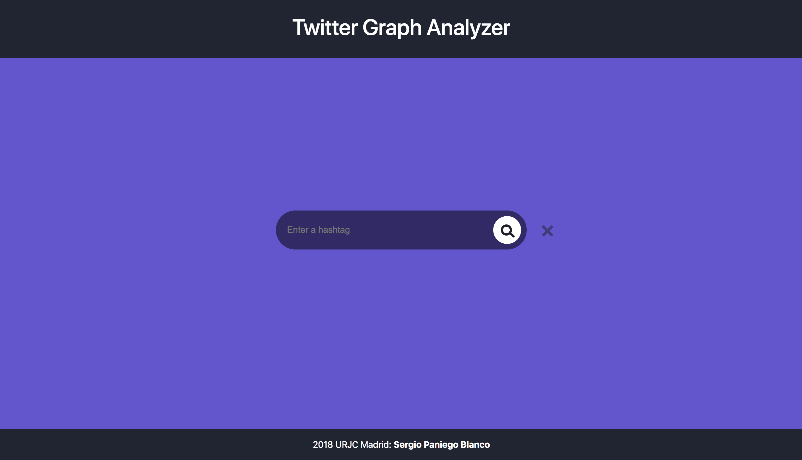
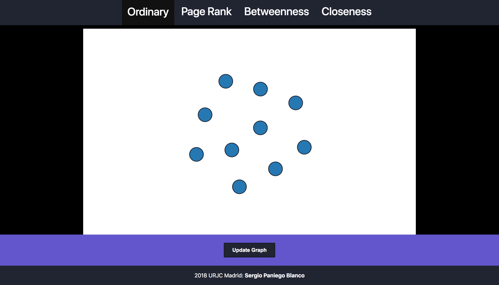

# Twitter Graph Analyzer
This project is the base of one of my dissertations for my Dual Degree in Computer Engineering and Software Engineering.
This dissertations is focused on the design and implementation of efficient heuristic methods for obtaining, analyzing
and visualizing social networks. To do that, I have chosen Twitter as the Social Network to be studied. 
## Introduction
To simplify what the project aims to do, we would say that having a word given filling the form on the front page, 
live tweets are retrieved from the network to work on them. Having those tweets stored in our database, with their 
relationships, we can analyze them with different algorithms having a beautiful visualization that help us in the process.
## Technologies involved
The project mixes many different technologies in order to complete its purpose. The backend is written in **Python** with the 
help of **Django**. We use the **Twitter API** to get the tweets and relevant information to work on them. The tweets are stored 
in a graph database, **Neo4j**. For the front-end we use plain **HTML, CSS and JS** and a little help of **D3js** library to 
show the graph on an appealing format to the final user. 
## What do I need to run the project
*We are working on having all the infrastructure available as a Docker container so it's easier to have it working.*  
First of all you need to download the project using  
 ```
 git clone https://github.com/sergiopaniego/TwitterGraphAnalyzer.git
 ```
* **Python 3.6**  
[Downlooad Python here](https://www.python.org/downloads/)
* **Neo4**j
The password you inizializate the database with should be stored on a secrets.py file in the project's directory 
as the value of a password variable  
[Neo4j's download page](https://neo4j.com/download/)
* **Django**  
[Django's download page](https://www.djangoproject.com/download/)
* **Twitter API credentials**  
Same that with Neo4j, credentials should be stored in that secrets.py file so everything works securely  
[Twitter API's web](https://developer.twitter.com/en/docs)  

After you've got everything ready, go to the project directory and start the Python project running the following command  
 ```
 python3 manage.py runserver
 ```  
We have to start the database too going to the bin folder in neo4j's directory and running. This process should be avoided if 
we have the desktop application because we directly start the database from there  
 ```
 ./neo4j start
 ```
Once you're done with it, you can stop the database running  
 ```
 ./neo4j stop
 ```
## How does it work
After you have started the python program, you can go to the URL you allocated the program in and a web page like this will appear  
  
Them you just have to type in the input form the word you want to track.
That will take you to a web page with the following look  
  
Where you can see the different tweets as nodes of the graph, each one with their relationships shown. Clicking on a node,
you will see on the bottom on the graph a detail of the tweet with the relevant information on it. The Update Graph button 
on the bottom part of the page reloads the page and brings the new nodes and connections added to the graph.
On the header you can select the algorithm you would like to apply to the graph so we can have a better understanding of the relationships the nodes have in between.
Selecting any of the algorithms will calculate it and retrieve the new graph with the algorithm applied.
## Available algorithms
The information we get from Twitter is a bit exiguous if we just so the graph as it comes. We can really get a real insight on 
what the graph is information is trying to say. That's why we apply different algorithms to the graph. From now, our project 
can apply three different algorithms to that info, which are:
* **Page Rank**: algorithm used by Google Search to rank websites in their search engine results. PageRank counts the number 
and quality of links to a page to determine an estimate of how important the website is. The underlying assumption 
is that more important websites are likely to receive more links from other websites. More info on how it works [here](http://ilpubs.stanford.edu:8090/422/1/1999-66.pdf).
* **Betweenness**: In graph theory, betweenness centrality is a measure of centrality in a graph based on shortest paths. 
For every pair of nodes in a connected graph, there exists at least one shortest path between the nodes such that either
 the number of relationships that the path passes through (for unweighted graphs) or the sum of the weights of the relationships
  (for weighted graphs) is minimized. The betweenness centrality for each vertex is the number of these shortest paths that pass
   through the vertex.
* **Closennees**: The Closeness Centrality of a node measures the distance from that node to all other nodes.
 Nodes with a high closeness score have the shortest distances to all other nodes. The premise of this algorithm is that
  nodes with short distance to other nodes can spread information very efficiently through the network. This is important 
  for the availability of knowledge and resources.

We plan to add more algorithms in the future so we can better understand the information from the graph.
## Future work
Several approaches but we work on the project, but we think that the most nededd improvements are the following:
* Having the project transform to a Docker image so it's easier to anyone to see what's all about 
* Check what algorithms would be nice to add to the project and add them to the final project. 
* Add tests to the project in order to check that everything is working as it's supposed
* We think it would be nice to have everything managed by a continuous integration tool so we can for example 
create the Docker image from the new code added automatically and run the tests before doing that.
* Work on how the info could be transformed to get the most out of it